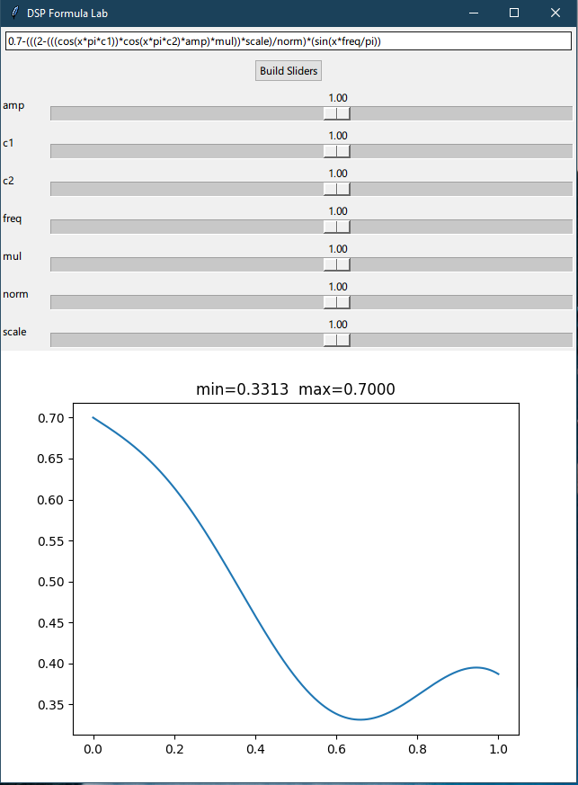

# tool-quick_formula_check

- make it accept various forms of dsp... one dialect or converting is not good.
  - that means a dictionary facility for major daws / languages whatever
- inspection and bounds checks
- auto normalise doubles etc

That should be it!
